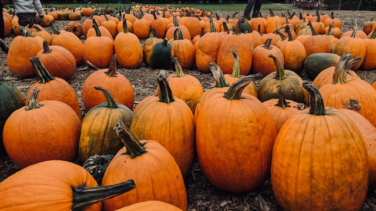
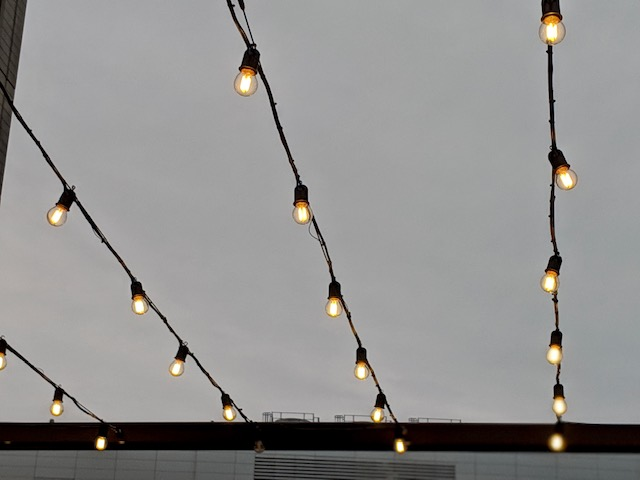
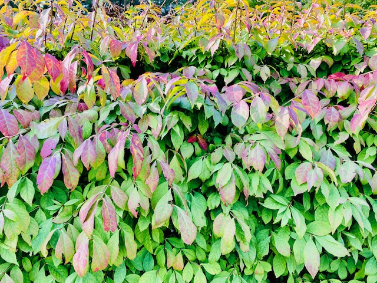
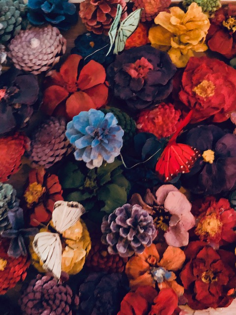
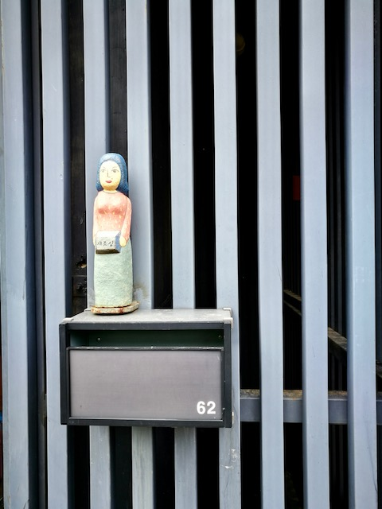
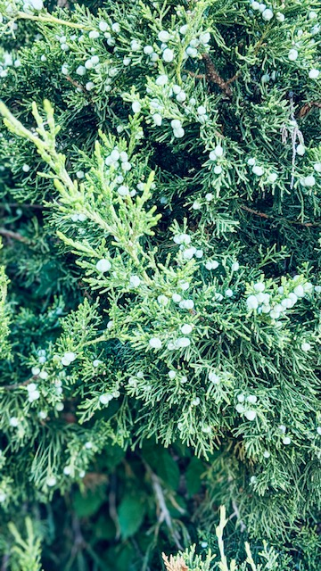
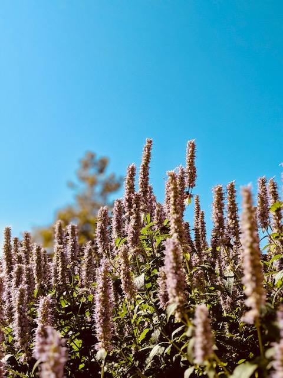
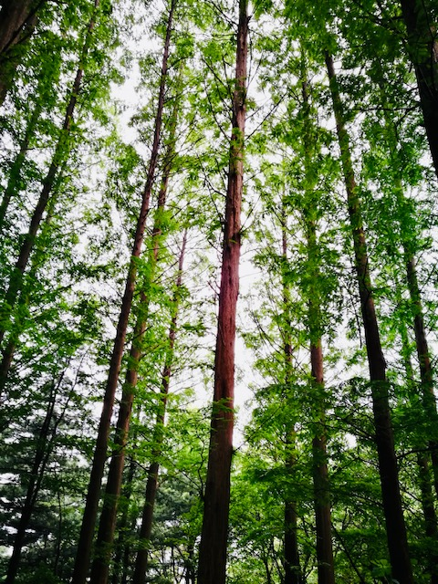

------
### Collections, patterns, and repetitions 
| | | | |
|:-------------------------:|:-------------------------:|:-------------------------:|:-------------------------:|
|  |  |||  
|  |  |||
|  |  |||

------
### Things in color

------
### Objects with emotions 

------
### Things that are organized
